# geoLLM — gempy example suite

A comprehensive, standalone collection of example scripts demonstrating the `gempy` 3D structural geological modeling library (v3 API, gempy 2026.0.3). Every script is self-contained and can be run independently. Almost all of them load real gempy tutorial/survey datasets from `examples/data/` (see below) rather than hand-crafted numbers — the exceptions are noted per-script.

## Setup

```
python -m venv .venv
.venv\Scripts\pip install --upgrade pip
.venv\Scripts\pip install -r requirements.txt
```

Script 18 (`18_probabilistic_inversion.py`) additionally needs:

```
.venv\Scripts\pip install -r requirements-optional.txt
```

Run any script from the project root:

```
.venv\Scripts\python examples\01_getting_started.py
```

Figures are saved to `examples/outputs/` in addition to displaying interactively. To run headlessly (no blocking GUI windows), set `$env:MPLBACKEND="Agg"` before invoking a script.

## Examples at a glance

| # | Script | Demonstrates |
|---|---|---|
| 00 | verify_installation | Environment sanity check |
| 01 | getting_started | Minimal end-to-end model |
| 02 | manual_structural_frame | Building a model via raw StructuralFrame/Element/Group objects |
| 03 | csv_data_workflow | Loading surface points/orientations from CSV |
| 04 | synthetic_geometries_gallery | Anticline, syncline, recumbent fold, pinchout |
| 05 | unconformities_and_series_stacking | Erode vs onlap unconformities |
| 06 | single_fault | One normal fault |
| 07 | multiple_faults_and_graben | Fault-fault relations, graben structure |
| 08 | finite_faults | Spatially-bounded faults (and the current upstream limitation) |
| 09 | combination_model | Fault + unconformity + fold combined |
| 10 | grids_and_topography | Custom/section grids, random topography |
| 11 | visualization_2d | plot_2d deep dive |
| 12 | visualization_3d | plot_3d / pyvista deep dive |
| 13 | topology_analysis | Adjacency graph of geological bodies |
| 14 | interpolation_and_kernels | Kriging kernel functions |
| 15 | anisotropy_and_backend_config | Anisotropy modes, numpy vs PyTorch backend |
| 16 | point_evaluation | Querying the model at arbitrary XYZ points |
| 17 | gravity_forward_modeling | Forward gravity modeling |
| 18 | probabilistic_inversion | Bayesian inference with Pyro (experimental) |
| 19 | json_model_io_and_export | JSON/binary save-load, VTK mesh export |

## Script details

### 00 — `verify_installation.py`
**Capability:** environment sanity check, no model built.
Imports `gempy`, `gempy_viewer`, `pyvista`, prints their versions, and asserts the default computation backend is `AvailableBackends.numpy`. No output image — there's nothing to plot, so this is a deliberate exception to the "every script saves a figure" convention.

### 01 — `getting_started.py`
**Capability:** the smallest complete gempy workflow — `create_geomodel` → `add_surface_points`/`add_orientations` → `compute_model` → plot. Establishes the mandatory rename step after `StructuralFrame.initialize_default_structure()`.
**Data:** `examples/data/tut-ch1-7/onelayer_interfaces.csv` + `onelayer_orient.csv` — gempy's own real single-layer tutorial dataset (real survey-style UTM-like coordinates, formation "layer1"), read with pandas and fed to `add_surface_points`/`add_orientations` by hand (rather than `ImporterHelper`) so the rename-gotcha this script teaches stays front and center.

`outputs/01_getting_started_2d.png` — a 2D cross-section of the real "layer1" surface at its true coordinate scale, gently dipping across the section.

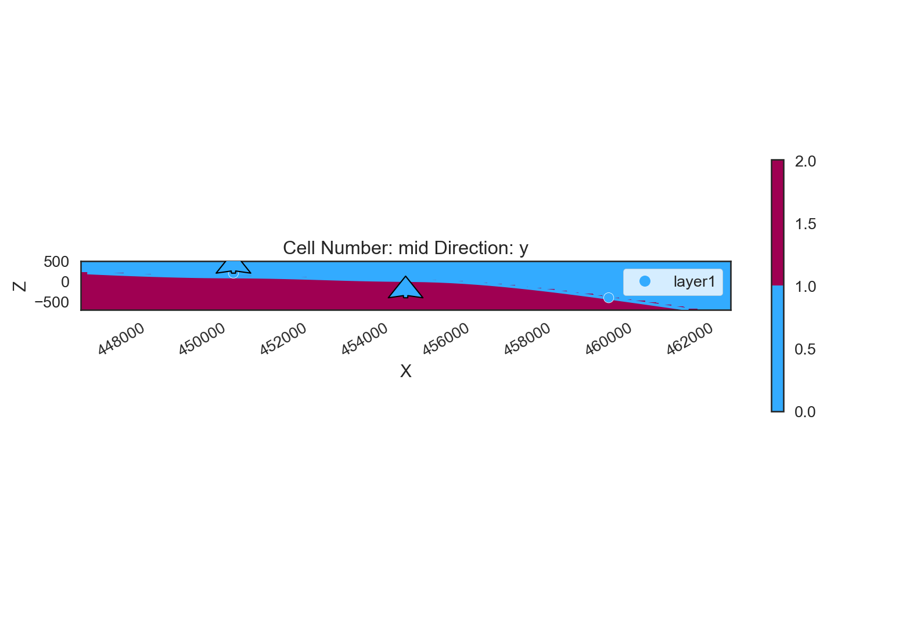

`outputs/01_getting_started_3d.png` — the same model in 3D.

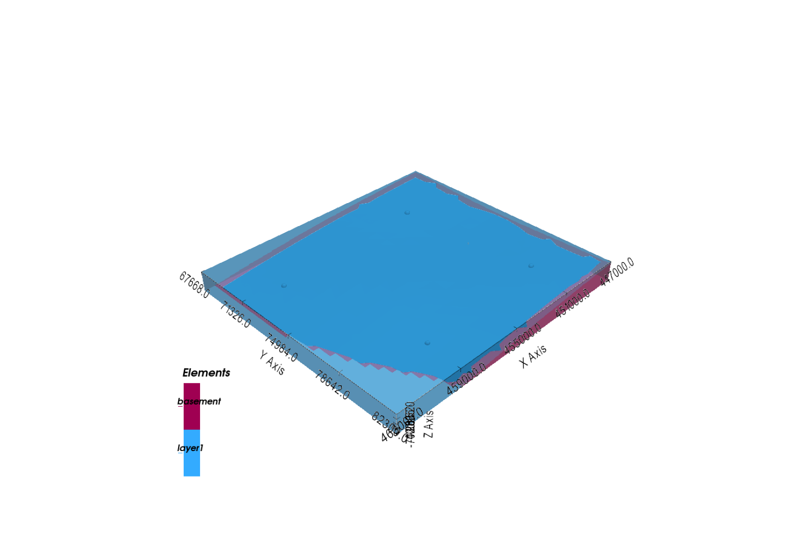

### 02 — `manual_structural_frame.py`
**Capability:** building a model by hand from `StructuralElement`/`StructuralGroup`/`StructuralFrame` and `SurfacePointsTable.from_arrays`/`OrientationsTable.from_arrays`, bypassing the `add_surface_points` convenience API — the pattern for programmatic model generation.
**Data:** `examples/data/jan_models/model1_surface_points.csv` + `model1_orientations.csv` — gempy's own real two-flat-layer teaching model, read with pandas and fed into `from_arrays()` by hand to keep the "manual construction" pattern this script teaches.

`outputs/02_manual_structural_frame_2d.png` — two flat horizontal layers (rock2 over rock1 over basement) at their real coordinate scale.

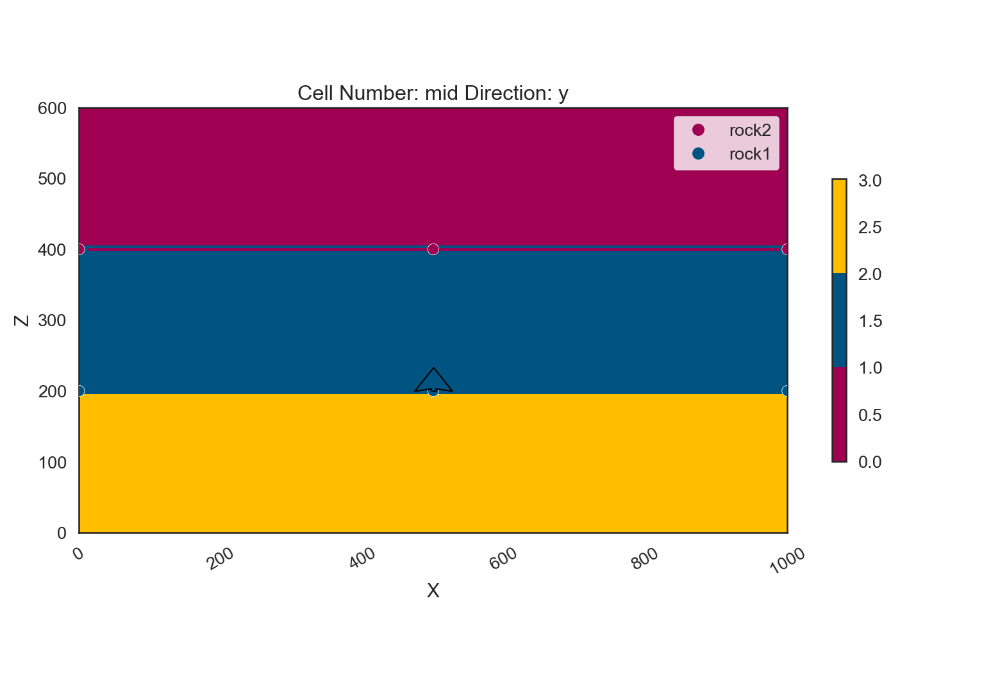

### 03 — `csv_data_workflow.py`
**Capability:** the CSV-driven workflow most real gempy projects use: pointing `gp.data.ImporterHelper` at surface-points/orientations CSVs on disk, then calling the (mandatory, for CSV-loaded models) `map_stack_to_surfaces`.
**Data:** `examples/data/jan_models/model2_surface_points.csv` + `model2_orientations.csv` — gempy's own real anticline teaching dataset, loaded unmodified straight off disk (this script used to write its own synthetic CSVs first; it now loads a real one directly, which is the more representative real-world pattern).

`outputs/03_csv_data_workflow_2d.png` — the real two-layer anticline (rock1/rock2), loaded entirely from CSV.

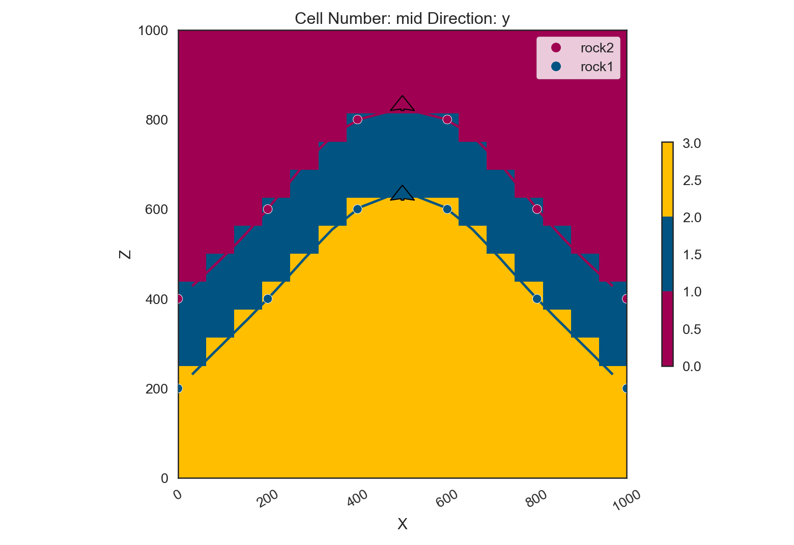

### 04 — `synthetic_geometries_gallery.py`
**Capability:** a gallery of four classic fold/layer geometries — anticline, recumbent fold, and pinchout are real; syncline is derived from real data (see below). Not using `gp.generate_example_model`, since its presets download the same underlying CSVs from GitHub at call time for every case except a trivial flat-layer one — this suite loads the files directly and locally instead.
**Data:** `examples/data/jan_models/model2` (anticline), `model3` (recumbent fold), and `model4` (pinchout) — gempy's own real synthetic teaching geometries, loaded via `ImporterHelper`. Syncline has no direct real-data equivalent upstream, so it's derived here by mirroring model2's real Z values (and flipping dip accordingly) rather than hand-crafted from scratch.

`outputs/04_anticline.png` — a real symmetric dome (upward fold), now with both real strata (rock1, rock2) instead of a single hand-crafted surface.


`outputs/04_syncline.png` — the mirrored-real bowl shape.

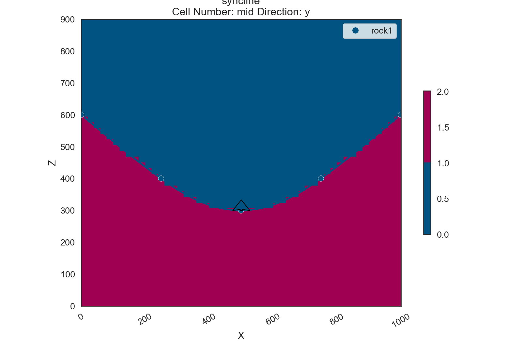

`outputs/04_recumbent_fold.png` — a real overturned fold; dip values greater than 90° (185.73° / 354.27° in the real data) encode overturned bedding.

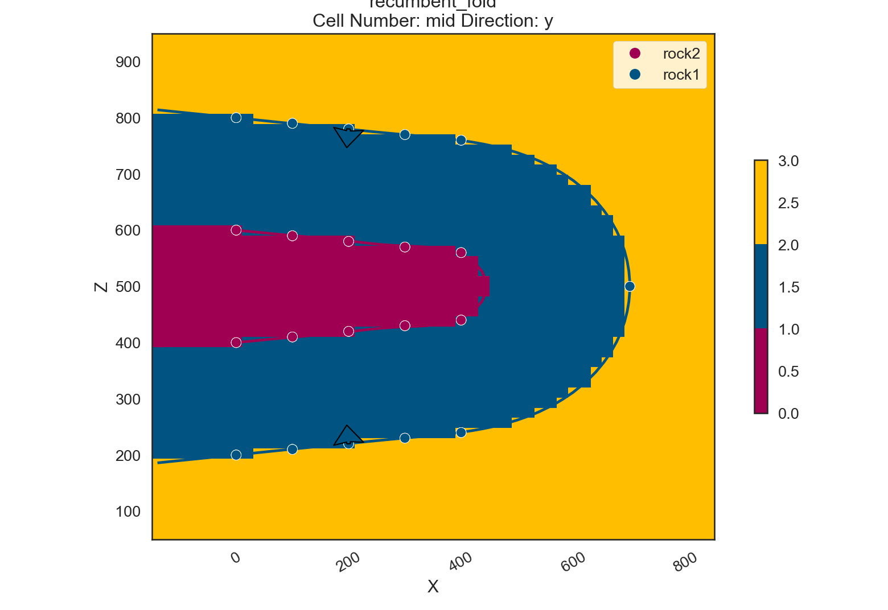

`outputs/04_pinchout.png` — real surfaces converging in thickness toward one end without ever crossing.

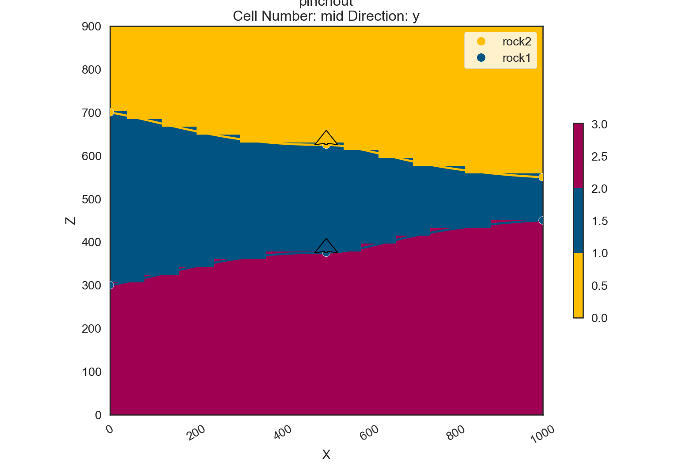

### 05 — `unconformities_and_series_stacking.py`
**Capability:** the two classic unconformity relationships. A "cover" layer's `StructuralGroup.structural_relation` is toggled between `StackRelationType.ERODE` and `.ONLAP` against a folded base pair below, then recomputed for each.
**Data:** `examples/data/jan_models/model6_surface_points.csv` + `model6_orientations.csv` — gempy's own real unconformity teaching dataset (a folded rock1/rock2 pair capped by a near-flat rock3), loaded via `ImporterHelper`. The real fold geometry happens to intersect the cover elevation cleanly, producing a dramatic difference between the two relations.

`outputs/05_erode.png` — the cover erosively truncates the folded rock1/rock2 pair flat wherever it pokes above the cover's elevation.

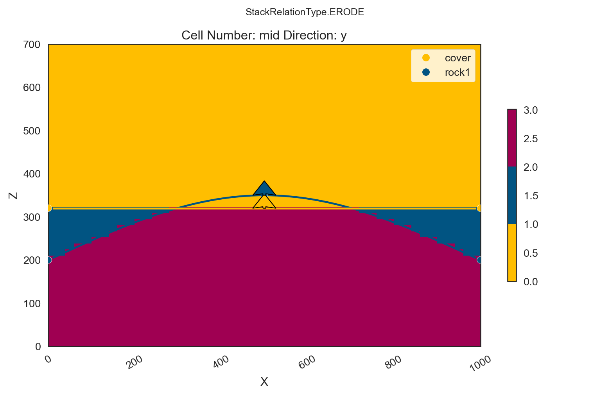

`outputs/05_onlap.png` — the same fold, now poking up through the cover instead of being cut off.

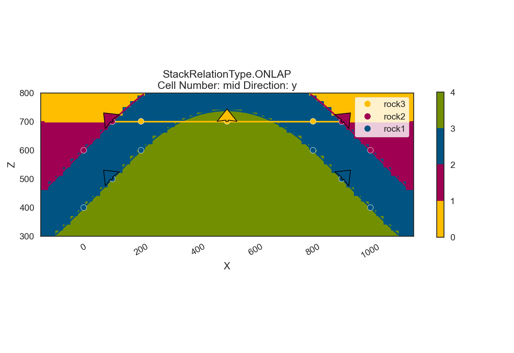

### 06 — `single_fault.py`
**Capability:** one normal fault offsetting two rock layers, via a `FAULT`-type `StructuralGroup`, a `fault_relations` matrix, and `gp.set_is_fault`.
**Data:** `examples/data/jan_models/model5_surface_points.csv` + `model5_orientations.csv` — gempy's own real single-fault teaching dataset (formations "rock1"/"rock2" plus a "fault" surface), loaded via `ImporterHelper`.

`outputs/06_single_fault_2d.png` — a clear vertical offset in the rock1/rock2 contacts across the real fault trace.

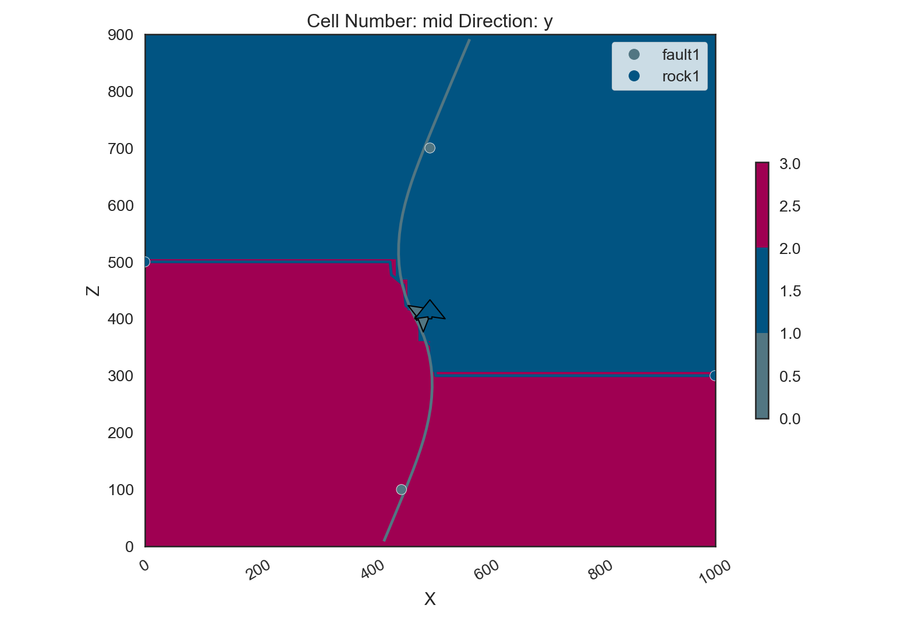

`outputs/06_single_fault_3d.png` — the same fault surface and offset rendered in 3D.

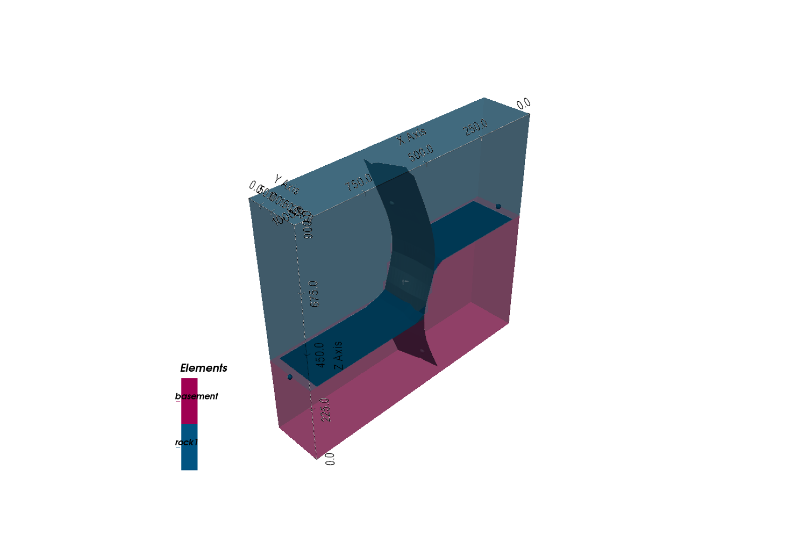

### 07 — `multiple_faults_and_graben.py`
**Capability:** two faults with opposing dip directions plus `gp.set_fault_relation`'s fault-fault interaction matrix — the classic graben pattern.
**Data:** `examples/data/lisa_models/interfaces7.csv` + `foliations7.csv` — gempy's own real graben teaching dataset: two real faults (Fault_1, Fault_2) bounding six real stratigraphic formations (Gneiss, Schist, Sandstone_2, Shale, Siltstone, Sandstone), loaded via `ImporterHelper`. These files carry a few extra bookkeeping columns beyond the minimal X/Y/Z/formation schema (series, isFault, annotations, ...) — `ImporterHelper` looks columns up by name, so the extras are simply ignored.

`outputs/07_graben_2d.png` — all six real strata, with the block between the two faults visibly dropped down relative to the flanks.

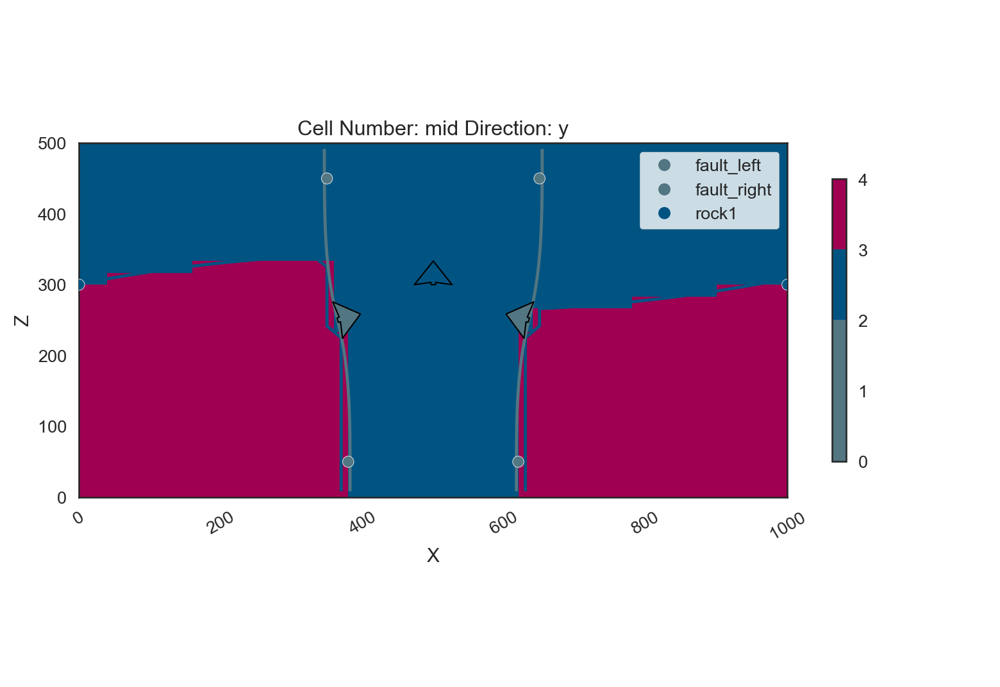

`outputs/07_graben_3d.png` — the same graben structure in 3D.

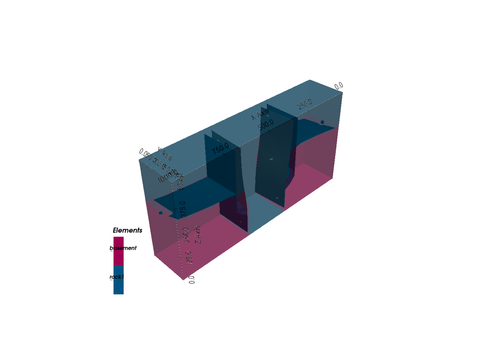

### 08 — `finite_faults.py`
**Capability:** an honest look at two real limitations, not one. `gp.set_is_finite_fault` is present in gempy 2026.0.3's public API but its implementation is a bare `raise NotImplementedError`. The script calls it inside a `try/except` and prints what happens, then tries the one workaround people reach for — confining a fault's own surface-point data to a sub-region of the model — and discovers, with a numerical voxel-diff to prove it rather than just eyeballing a plot, that this doesn't actually work either: this fault's points are exactly coplanar, and gempy's potential-field interpolation extrapolates a linear drift trend beyond the data, so it reconstructs the *same infinite plane* regardless of how few points define it near the edges. A genuinely bounded fault would need real curvature built into its geometry, which isn't a documented gempy workflow.
**Data:** `examples/data/jan_models/model5_surface_points.csv` + `model5_orientations.csv` — the same real single-fault dataset used by script 06, reused here since "finite fault" is a limitation of the API itself rather than a distinct geometry.

`outputs/08_full_extent_fault.png` — the default behavior, sliced near the fault data's original Y edge.


`outputs/08_bounded_workaround.png` — the same slice after attempting to confine the fault's data. The console output reports the exact voxel count changed (a handful out of tens of thousands) — visually indistinguishable from the first image, which is itself the finding.

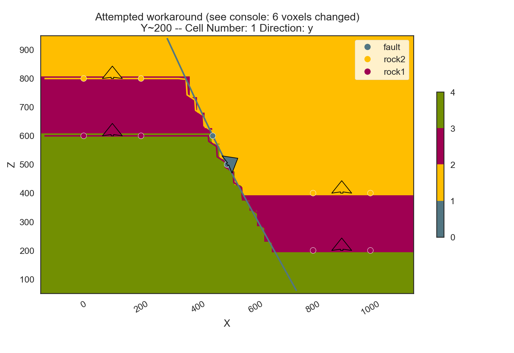

### 09 — `combination_model.py`
**Capability:** a capstone combining everything from scripts 05–07 — a fault, an unconformity-bounded capping layer, and a two-surface folded series — all in one geomodel, mirroring gempy's own official `g07_combination.py` example.
**Data:** `examples/data/jan_models/model7_surface_points.csv` + `model7_orientations.csv` — gempy's own real combination teaching dataset (formations rock1/rock2/rock3 plus a fault), loaded via `ImporterHelper`.

`outputs/09_combination_2d.png` — four real lithologies (fault, rock1, rock2, rock3) together: a folded rock1/rock2 pair, a near-flat rock3 cap, and a fault cutting through the section.

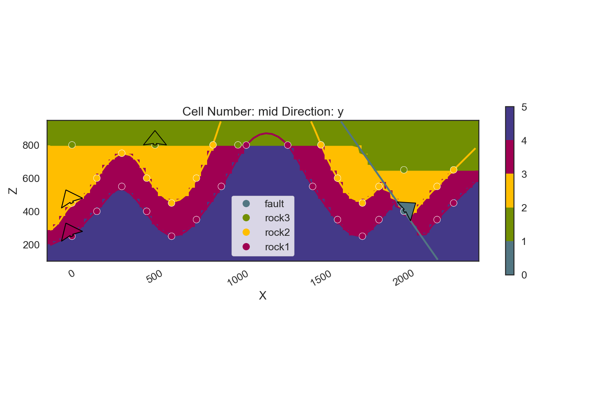

`outputs/09_combination_3d.png` — the same combined model in 3D.

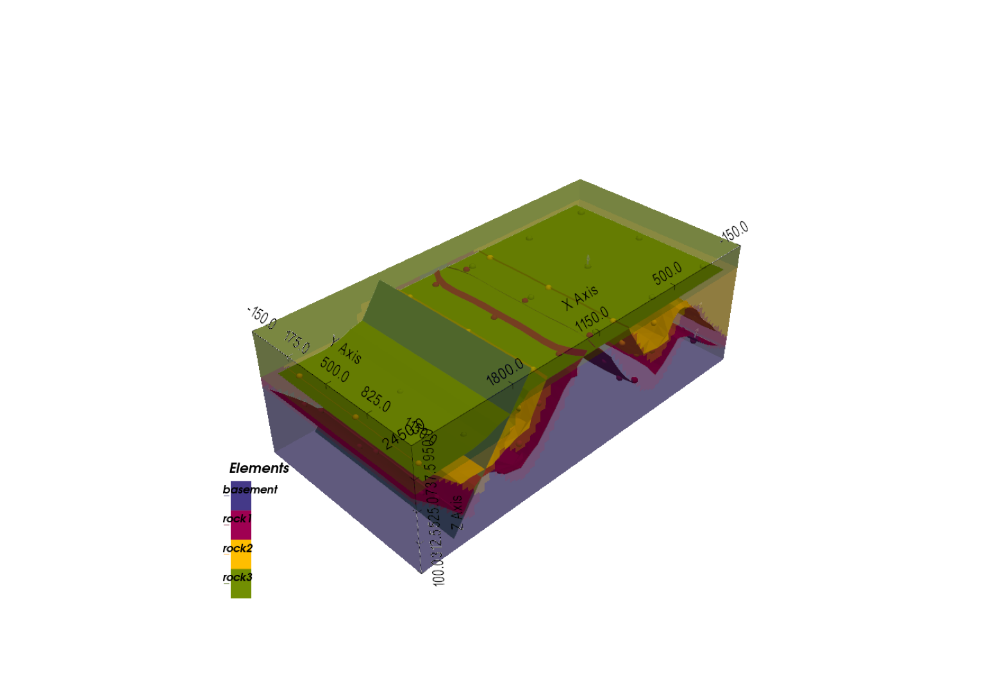

### 10 — `grids_and_topography.py`
**Capability:** gempy's non-default grid types layered onto the standard regular grid: `set_custom_grid` (arbitrary query points), `set_section_grid` (a named vertical cross-section), and `set_topography_from_random` (a fractal elevation surface).
**Data:** `examples/data/jan_models/model1_surface_points.csv` + `model1_orientations.csv` — the same real two-flat-layer dataset used by script 02, loaded via `ImporterHelper`. The topography surface itself stays synthetic (`set_topography_from_random`): a real DEM can be loaded via `gp.set_topography_from_file` (and this suite's `examples/data/AlesModel/_cropped_DEM_coarse.tif` / `tut-ch1-7/bogota.tif` would work), but that function requires the optional `subsurface` package, which this suite doesn't otherwise depend on.

`outputs/10_section_traces.png` — the section trace line plotted alone, at the real model's coordinate scale.

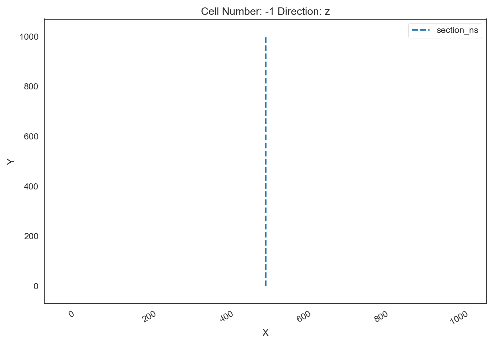

`outputs/10_sections_and_topography.png` — left: the cross-section with the area above the topography surface masked out; right: a map view of the random topography with contour lines and the section trace overlaid.

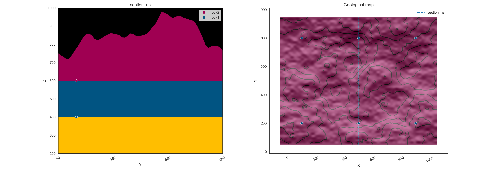

### 11 — `visualization_2d.py`
**Capability:** a deep dive into `gpv.plot_2d`'s options: multiple orthogonal slices in one call, the interpolated scalar field instead of discretized lithology, and boundaries-only rendering.
**Data:** `examples/data/jan_models/model2` — the same real anticline dataset used by script 04, loaded via `ImporterHelper`.

`outputs/11_orthogonal_slices.png` — the real anticline sliced along both X and Y directions side by side.

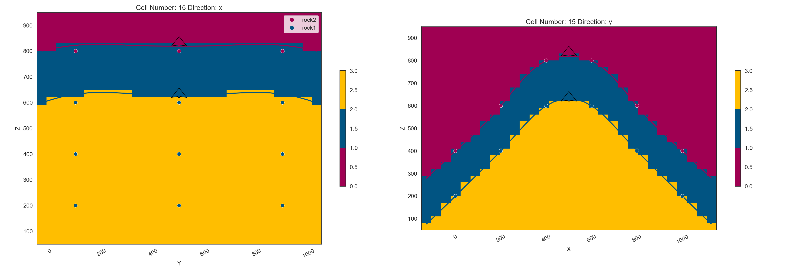

`outputs/11_scalar_field.png` — the continuous interpolated scalar field (contoured) instead of discrete lithology colors.


`outputs/11_boundaries_only.png` — just the surface contact lines, no fill and no raw data points — `show_boundaries=True, show_lith=False, show_data=False`.

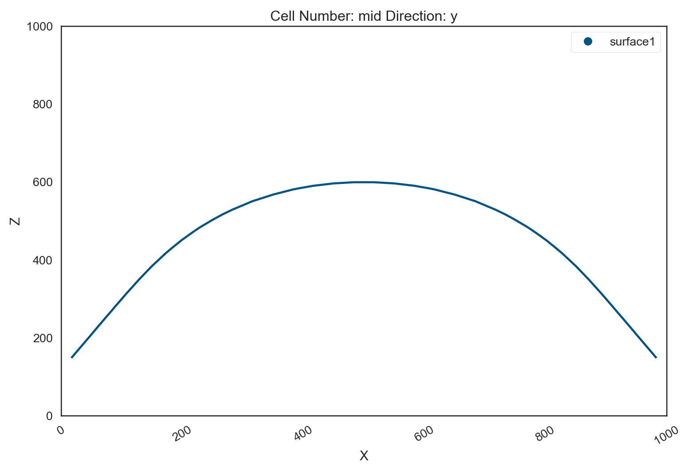

### 12 — `visualization_3d.py`
**Capability:** `gpv.plot_3d`'s static-image rendering path (`image=True`, off-screen, safe for headless runs) and a check of which `plotter_type` backends are actually implemented.
**Data:** `examples/data/jan_models/model2` — the same real anticline dataset used by script 04, loaded via `ImporterHelper`.

`outputs/12_static_screenshot.png` — an off-screen-rendered 3D view of the real anticline, captured via `image=True` and saved through matplotlib. The script also prints that only `plotter_type='basic'` works in this gempy_viewer version; `'background'`/`'notebook'` both raise `NotImplementedError`.

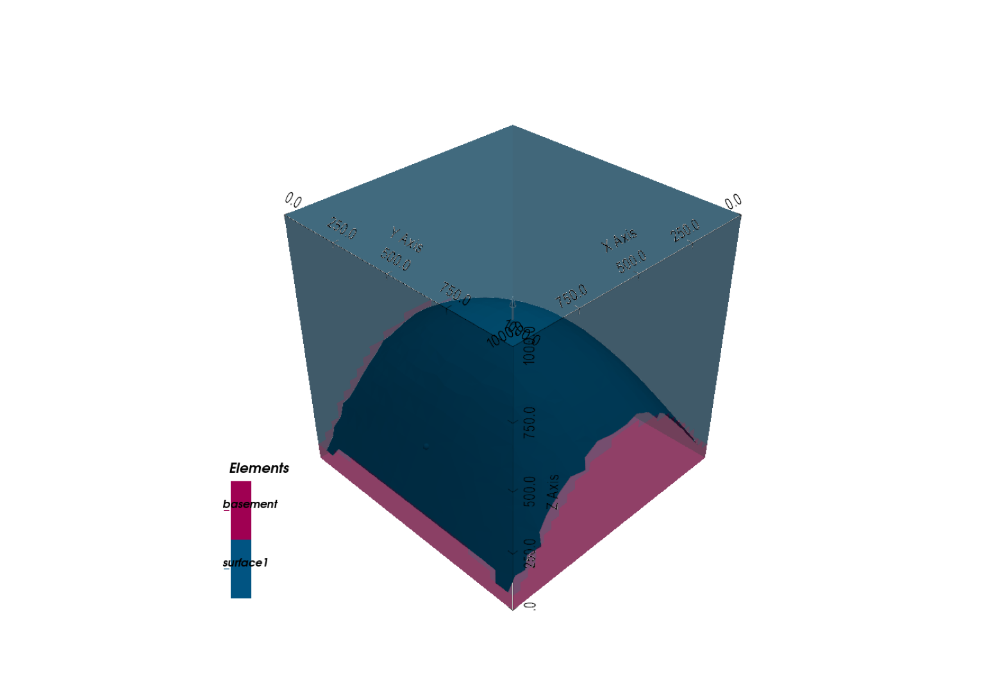

### 13 — `topology_analysis.py`
**Capability:** computing the adjacency graph between distinct fault-separated rock volumes via `gempy_plugins.topology_analysis`. Requires `intpolation_options_tye=DENSE_GRID` explicitly — mixing a plain `resolution=` grid with the default octree-based interpolation options crashes `compute_topology`.
**Data:** `examples/data/jan_models/model5` — the same real single-fault dataset used by scripts 06/08, loaded via `ImporterHelper`.

`outputs/13_adjacency_matrix.png` — a small adjacency matrix showing which lithology/fault-block combinations touch each other.

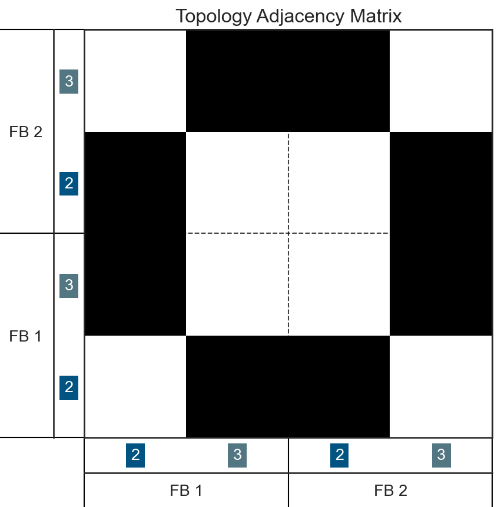

`outputs/13_topology_graph.png` — the same adjacency graph, overlaid as numbered nodes on a 2D cross-section of the real faulted model.

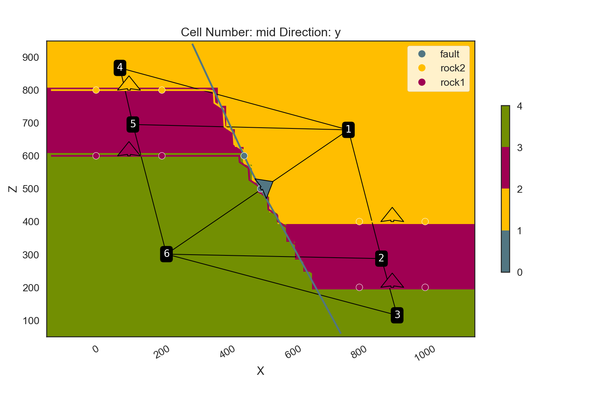

### 14 — `interpolation_and_kernels.py`
**Capability:** comparing gempy's RBF kernel functions (`cubic`, `exponential`, `matern_5_2`) used to interpolate the scalar field, including each kernel's condition number.
**Data:** `examples/data/jan_models/model2` — the same real anticline dataset used by script 04, loaded via `ImporterHelper`.

`outputs/14_kernel_cubic.png`, `outputs/14_kernel_exponential.png`, `outputs/14_kernel_matern_5_2.png` — the real anticline's scalar field under each kernel; the contour smoothness/shape varies subtly between kernels.

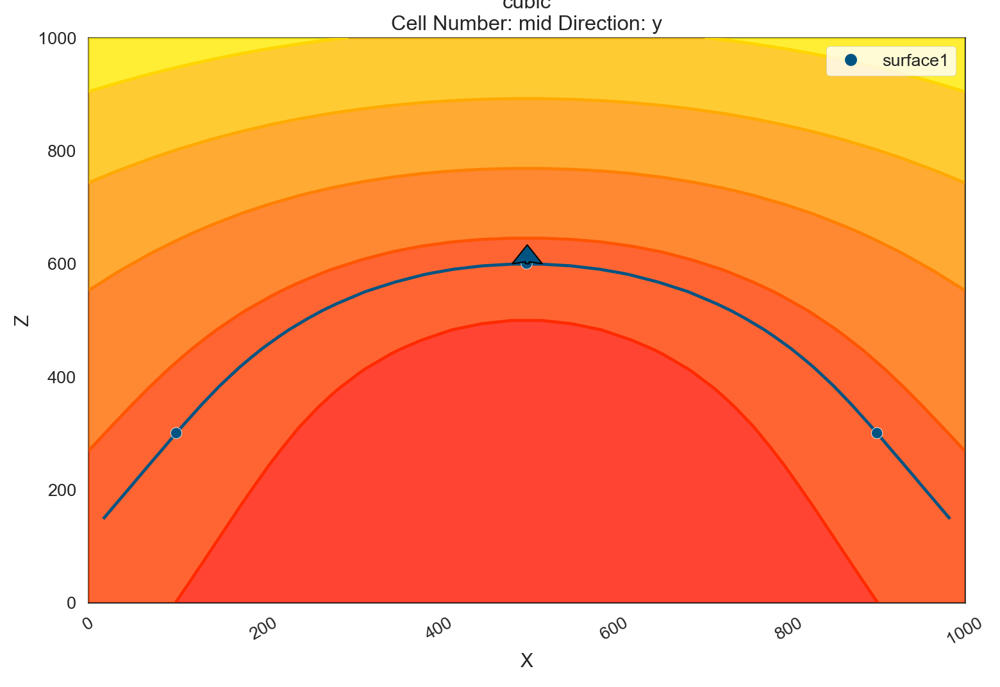
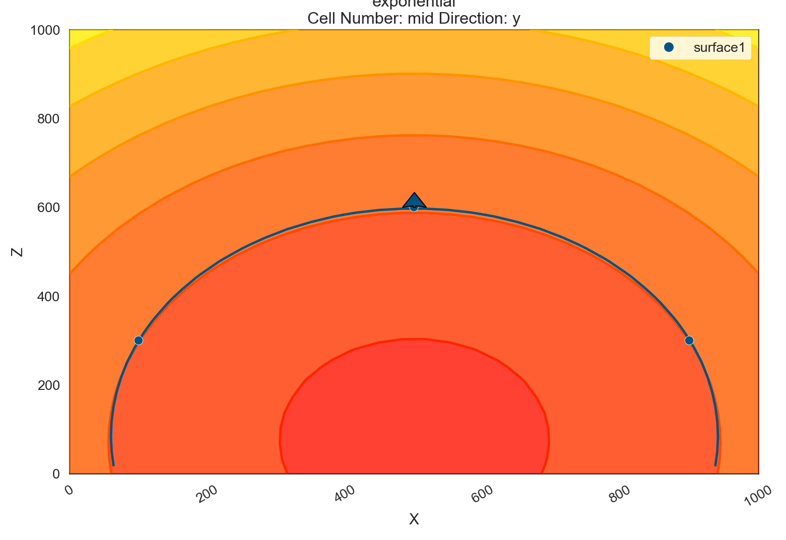
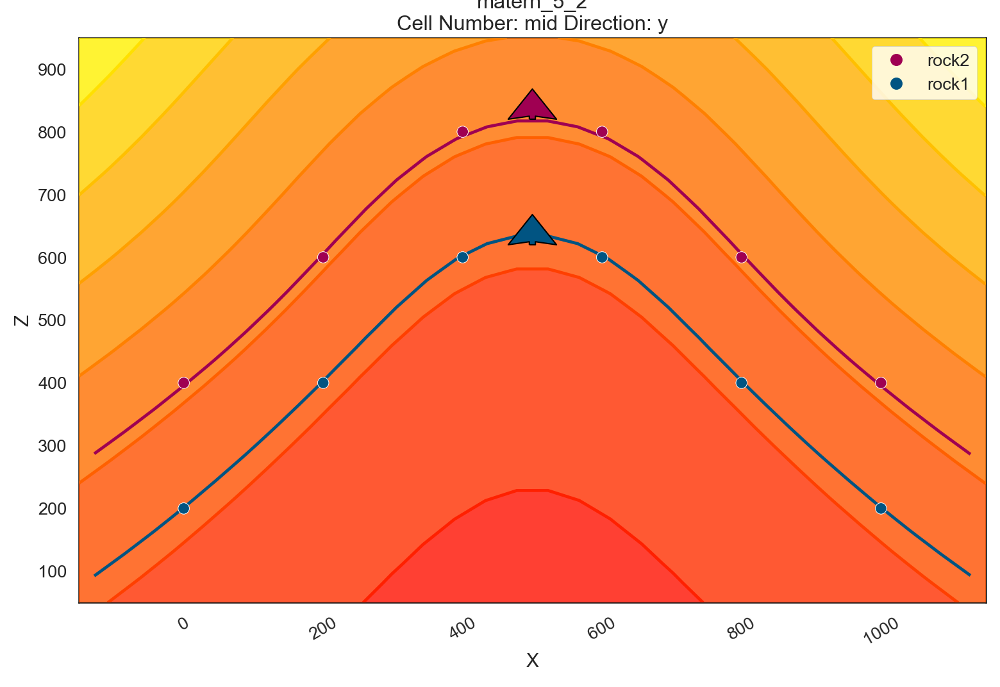

### 15 — `anisotropy_and_backend_config.py`
**Capability:** `GlobalAnisotropy.CUBE` vs `.NONE` transforms, plus the `numpy` vs `PyTorch` compute backends.
**Data:** kept synthetic/hand-crafted here, deliberately — the one script in this suite where real data was tried and reverted. The natural real-data candidate, `examples/data/tut_SandStone` filtered to its "EarlyGranite" formation, has a genuinely elongated real extent (~48km × 15km × 80m), but that's also a single sparse 27-point surface: interpolating it at that extreme aspect ratio produces visible numerical artifacts (thin spurious bands) rather than clean geology, and even then CUBE vs NONE still barely diverge — the same "subtle difference" limitation this comparison already has on sparse data either way. Real data made this specific demo noisier without fixing the thing it exists to show, so a small elongated (4:1) synthetic dataset is used instead: on a perfectly cubic extent, `CUBE` would have nothing to normalize and look identical to `NONE`.

`outputs/15_anisotropy_CUBE.png` / `outputs/15_anisotropy_NONE.png` — the same elongated anticline under each anisotropy mode (the visual difference is subtle — a known limitation of comparing on sparse data, not a bug).


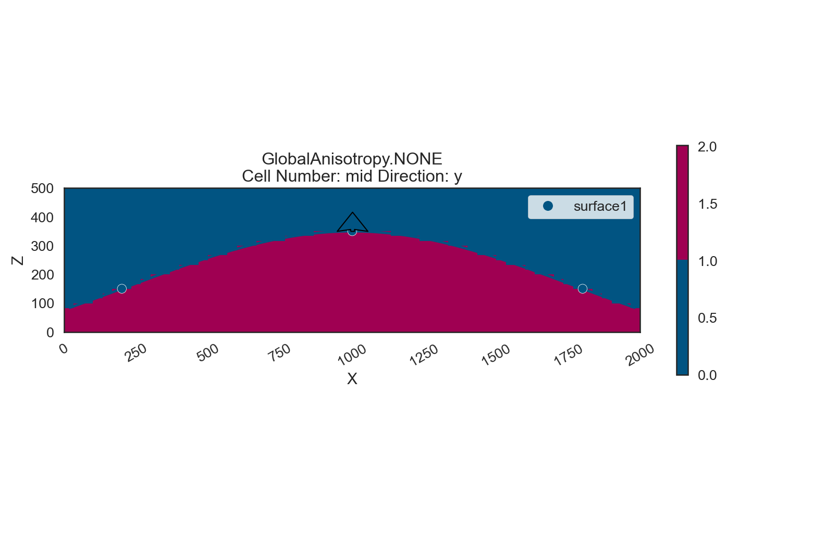

### 16 — `point_evaluation.py`
**Capability:** querying an already-computed model at arbitrary XYZ points via `gp.compute_model_at`, rather than only reading the regular grid — useful for evaluating a model along a borehole trace. Demonstrates restoring the grid type afterward, since `compute_model_at` replaces the active grid as a side effect.
**Data:** `examples/data/jan_models/model2` — the same real anticline dataset used by script 04, loaded via `ImporterHelper`.

`outputs/16_reference_model.png` — the real anticline the query points are evaluated against.

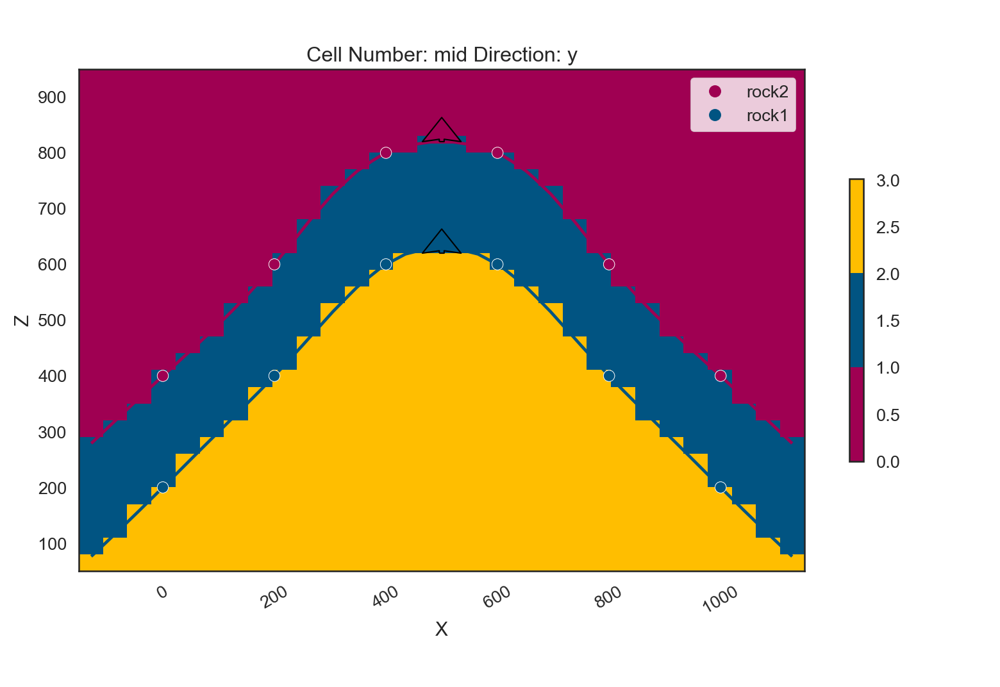

### 17 — `gravity_forward_modeling.py`
**Capability:** forward-modeling the gravity response of a real subsurface density contrast, evaluated at a line of real surface gravity-survey stations, via `set_centered_grid` + `calculate_gravity_gradient` + `GeophysicsInput`.
**Data:** `examples/data/tut_SandStone/SandStone_Points.csv` + `SandStone_Foliations.csv`, filtered to the "EarlyGranite" formation (the same real dataset used by script 15), plus a real profile of stations subsampled from `Sst_grav_500.xyz` — gempy's own real gravity survey grid for this deposit, picked to overlap the geological data's footprint.

`outputs/17_gravity_profile.png` — a clean, sharp negative gravity anomaly right over the real EarlyGranite body's density contrast — a genuinely compelling real result, unlike script 15's sparse-data limitations.

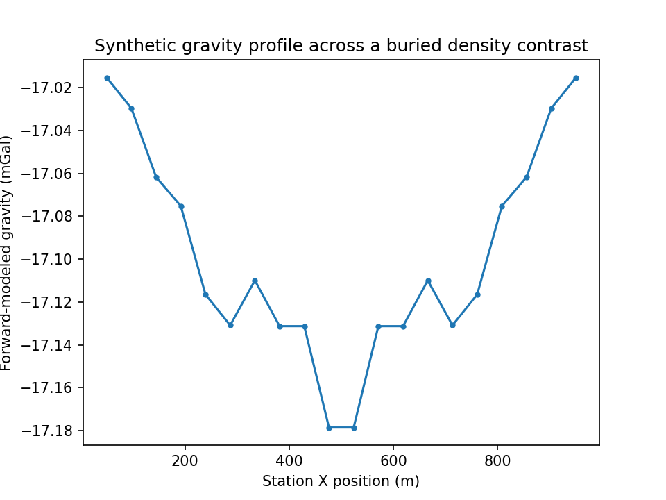

### 18 — `probabilistic_inversion.py` — *[advanced/experimental]*
**Capability:** Bayesian inference with Pyro directly against gempy's internals (not the unstable `gempy_probability` package). Puts a prior on a surface point's rescaled Z-coordinate, forward-runs the interpolator inside the probabilistic model, and uses NUTS to infer a posterior from one synthetic observation. Requires `compute_grads=True` on every `gp.compute_model` call in the chain, or PyTorch autodiff silently breaks.
**Data:** kept synthetic/hand-crafted here, deliberately — the other script in this suite that intentionally didn't switch to real data. The prior/forward/NUTS wiring is indexed against a specific surface point (index 0) and a specific custom-grid position (index 50), both tuned by hand against this exact tiny geometry. Swapping in a larger real dataset would shift those indices and risk silently breaking the already-fragile autodiff chain for no benefit to what this script teaches.

`outputs/18_trace.png` — the NUTS sample trace (left) and posterior histogram (right) for the sampled parameter, in gempy's internal rescaled coordinate space.

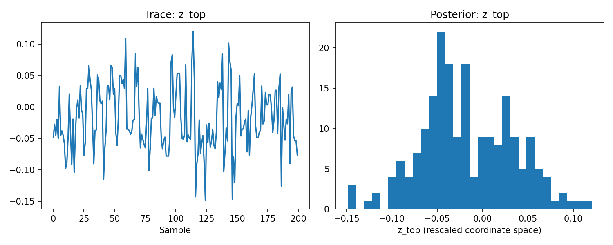

### 19 — `json_model_io_and_export.py`
**Capability:** three ways to persist a computed model: (1) genuine JSON round-trip via `gempy.modules.json_io.JsonIO` (geometry/config only), (2) gempy's own binary `.gempy` save format (still "in development" upstream), and (3) exporting computed surface meshes to VTK via pyvista.
**Data:** `examples/data/jan_models/model2` — the same real anticline dataset used by script 04, loaded via `ImporterHelper`.

No standalone figure — outputs are data files: `outputs/19_model.json`, `outputs/19_model.gempy`, `outputs/19_rock1.vtk`, `outputs/19_rock2.vtk` (open the `.vtk` files in ParaView or pyvista to inspect the exported meshes).

## Reference datasets

`examples/data/` holds a full mirror of gempy's own official example datasets, pulled from [gempy-project/gempy `examples/data/input_data`](https://github.com/gempy-project/gempy/tree/main/examples/data/input_data) (90 files, ~3.2 MB). Most of the folders below are now actively used by the scripts above (see each script's **Data:** line); a few remain unused reference material for building further examples:

| Folder | Contents | Used by |
|---|---|---|
| `jan_models/` | Real synthetic teaching geometries (model1–model7 + fixture/tutorial models) | Scripts 01\*, 02, 04, 05, 06, 08, 09, 10, 11, 12, 13, 14, 16, 19 |
| `lisa_models/` | Real graben teaching model (`interfaces7.csv` / `foliations7.csv`, plus 1-9 variants) | Script 07 |
| `tut_SandStone/` | Real mining-exploration model, including gravity survey stations (`.xyz`) and uncertainty parameters | Scripts 15, 17 |
| `tut-ch1-7/` | Real one-layer tutorial model plus a real DEM (`bogota.tif`) | Script 01 |
| `AlesModel/` | Real cross-section/map data from Ales, France, plus a cropped DEM | Reference only (its DEM is a candidate for a real script 10 topography, blocked on the optional `subsurface` dependency) |
| `Claudius/` | Dense point-cloud interpolation benchmark (four large point sets + fault + dip data) | Reference only |
| `Hecho/` | Multi-horizon geomodeling benchmark (9 horizons, 3 fault lines, dip data) | Reference only |
| `Moureze/` | Dense, heavily-faulted 3D point-cloud benchmark, plus E-W/N-S cross-sections | Reference only |
| `perth_basin/` | Regional real basin model excerpt with faults and topography | Reference only |
| `striplog_integration/` | Borehole "striplog" tops files (`.tops`) | Reference only |
| `tests/` | Small fixture data from gempy's own test suite (fault relations) | Reference only |
| `tut-ch1-4/`, `tut-ch1-5/` | Tutorial chapter 1 fault-relations data | Reference only |
| `tut_chapter1/` | Simple fault + unconformity tutorial models, including geophysics variants | Reference only |
| `tut_chapter6/` | Chapter 6 tutorial interface/foliation data | Reference only |

\* Script 01 uses `tut-ch1-7`, not `jan_models`.

## Notes

- Targets gempy's current v3 API only (`gp.create_geomodel`, `gp.data.*`) — not the legacy v2 API (`gempy_legacy`).
- Almost every script loads real gempy tutorial/survey data from `examples/data/` (see each script's **Data:** line above) rather than hand-crafted numbers. The two deliberate exceptions are script 15 (real data made the anisotropy comparison noisier without fixing its inherent sparse-data limitation) and script 18 (its autodiff mechanics are indexed against a specific tiny hand-built geometry). Script 03 still generates nothing itself — it now loads a real CSV pair directly, which is more representative of how `ImporterHelper` actually gets used.
- Script 18 depends only on `pyro`/`torch` directly rather than the `gempy_probability` package, whose PyPI release lags far behind its API, and uses plain matplotlib rather than `arviz` for posterior plots (arviz 1.2.0 dropped Pyro support in favor of NumPyro-only).
- Every output image in `examples/outputs/` has been regenerated and visually spot-checked multiple times: when the suite was first built (catching overlapping titles, an unconformity example with no visible ERODE/ONLAP difference, an illegibly small plot, a cube-extent anisotropy comparison with nothing to compare, and an out-of-bounds gravity sampling radius); again after switching to real data (catching an unreadable anisotropy plot on an extreme real aspect ratio, fixed with `ve=` — then reverted per script 15's note above once the underlying data itself proved unsuitable); and a third pass that caught script 08's two "before/after" images being pixel-identical for a real geometric reason (see script 08's note above) rather than a rendering bug, which needed a different slice *and* an honest rewrite of what the workaround actually demonstrates.
